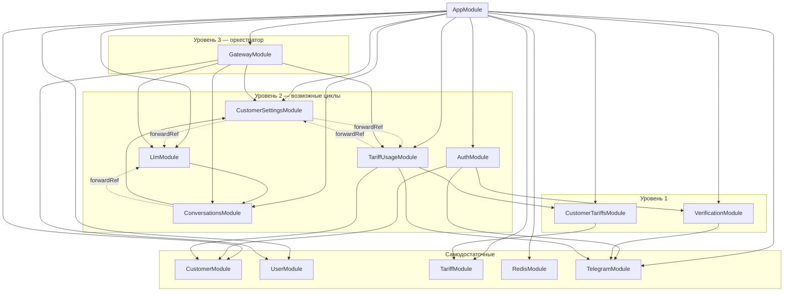

# Схема зависимостей модулей (NestJS)

## Граф импортов между модулями



## Циклические зависимости (где «запуталось»)

| Цикл | Модули | Как развязано |
|------|--------|----------------|
| **1** | **LlmModule** ↔ **ConversationsModule** | Только ConversationsModule использует `forwardRef(() => LlmModule)`. LlmModule импортирует ConversationsModule **без** forwardRef — при инициализации возможны проблемы. |
| **2** | **CustomerSettingsModule** ↔ **TariffUsageModule** | Оба используют `forwardRef` друг к другу — развязка есть. |
| **3** | **CustomerSettingsModule** → **LlmModule** | CustomerSettings использует `forwardRef(() => LlmModule)`. |

## Рекомендация по циклу Llm ↔ Conversations

В `llm.module.ts` лучше импортировать Conversations через forwardRef, чтобы цикл был развязан с обеих сторон:

```ts
// llm.module.ts
import { Module, forwardRef } from '@nestjs/common';
// ...
import { forwardRef } from '@nestjs/common';
import { ConversationsModule } from '../conversations/conversations.module';

@Module({
  imports: [
    // ...
    forwardRef(() => ConversationsModule),
  ],
  // ...
})
export class LlmModule {}
```

## Краткая таблица: кто кого импортирует

| Модуль | Импортирует |
|--------|-------------|
| **CustomerModule** | — |
| **UserModule** | — |
| **TariffModule** | — |
| **RedisModule** | — (global) |
| **TelegramModule** | ConfigModule, Mongoose (схема Customer — не модуль!) |
| **VerificationModule** | TelegramModule |
| **CustomerTariffsModule** | TariffModule |
| **AuthModule** | CustomerModule, VerificationModule, TelegramModule |
| **CustomerSettingsModule** | TariffUsageModule (forwardRef), LlmModule (forwardRef) |
| **TariffUsageModule** | CustomerTariffsModule, CustomerModule, TelegramModule, CustomerSettingsModule (forwardRef) |
| **ConversationsModule** | CustomerSettingsModule, LlmModule (forwardRef) |
| **LlmModule** | ConversationsModule *(без forwardRef)* |
| **GatewayModule** | CustomerSettingsModule, TariffUsageModule, UserModule, ConversationsModule, LlmModule |
